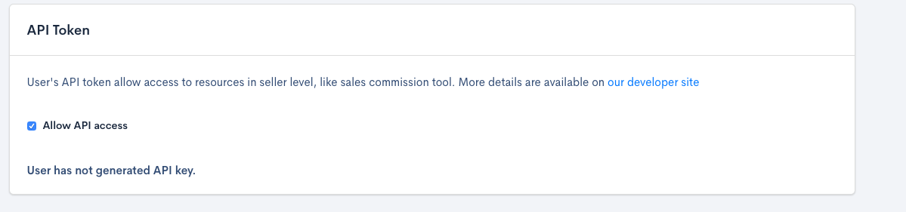
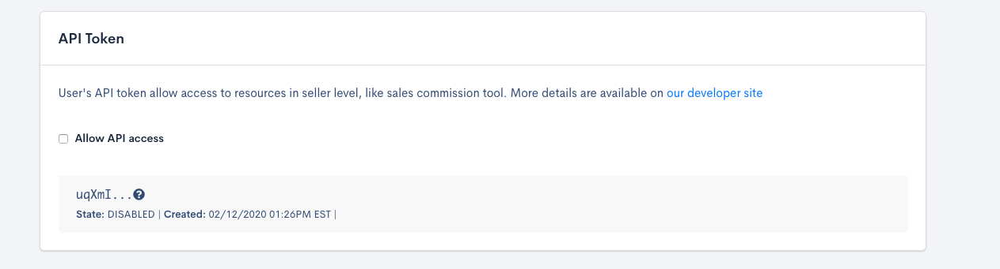
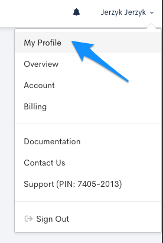
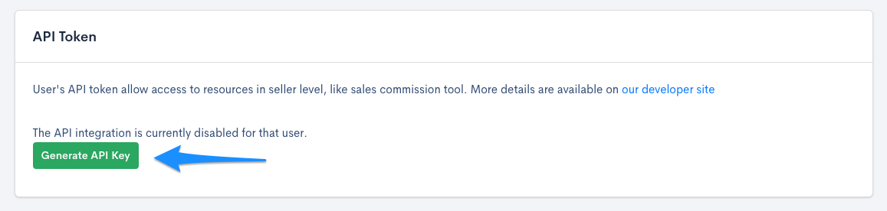
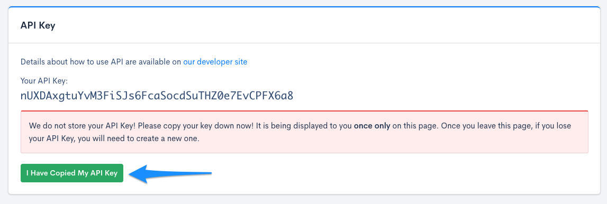
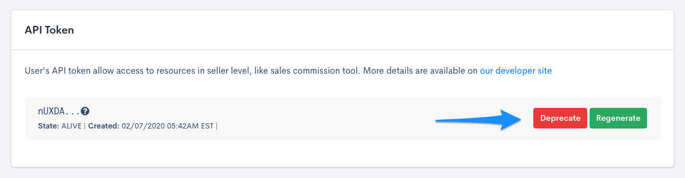
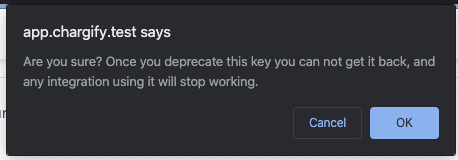
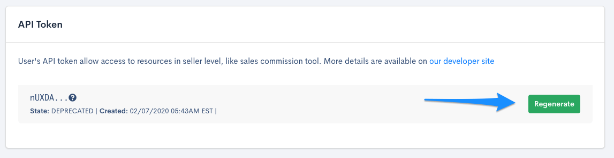

# 2020-04-20 New API Authentication

As of April 20 2020, the new authentication method will be enabled.
Up to now all available resources were at the level of the site, therefore creating the API Key per site was a sufficient solution. To share resources at the seller level, the new authentication method was introduced which is user authentication. Obtaining the User API Key is described below.

**Enable API Token View for Admin and Team Member**

API Token View is a form with the API settings in the user#edit page. Support, Manager or the Owner of the Seller all have the API Token View enabled by default, in addition, they have the possibility to manage who has access to the API Token View. In case the site Admin or a Team Member leaves the company the API Key can be easily deactivated.
    
In order to enable the API Token View, the support/owner should go to the user's list, click edit on the selected user and mark the checkbox. The API Token View will be enabled for the selected user. 
    

    
API Token View access can be denied, by unchecking the checkbox. The API Key will be automatically DISABLED, and the user will not have access to the API Token View anymore.
    

    
**Generate the API Key**

When the API Token View is enabled the generation of the API Key is possible. To do so, go to your profile:

Scroll to the API Token View and click "Generate API Key"

You'll be directed to the page with a new API Key which should be copied. It will be used to get Sales Reps data.

After this step, we are ready to perform seller level API queries.

**Deprecate the API Key**

Deprecating the API Key is possible on the API Token View

By clicking the “Deprecate” button. Additional popup with confirmation will be displayed

Deprecate option is also available for Chargify Staff and Owner of the Seller. It can be especially useful when API Key is compromised.

**Regenerate the API Key**

Another option when the key has been compromised is to regenerate the API Key. This is done in the API Token View by clicking on the “Regenerate” button. The old API Key will be deprecated and only the new key will be valid.

In order to retrieve sales commission resources, [check out sales commission API documentation.](https://developers.chargify.com/docs/api-docs/b3A6MTQxMDgzOTc-list-sales-commission-settings)