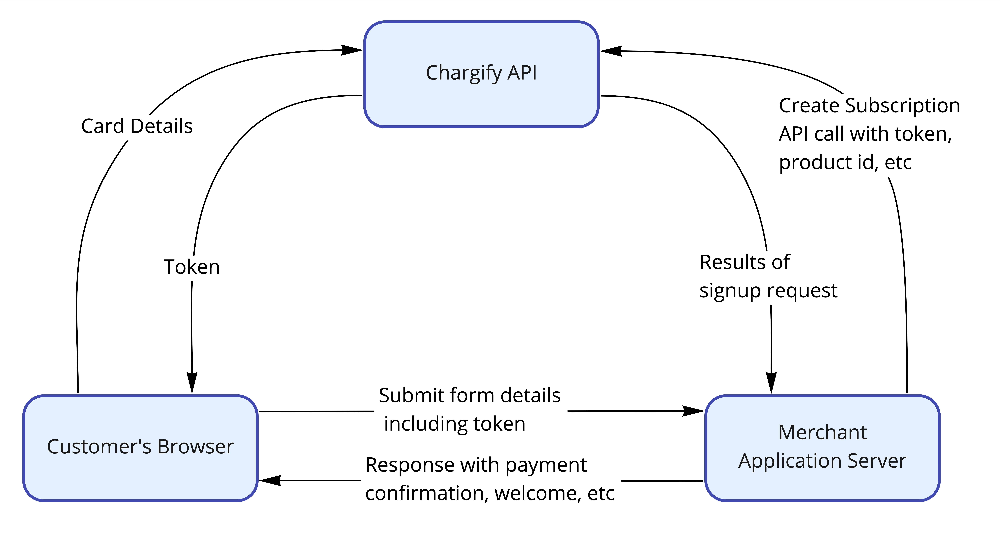
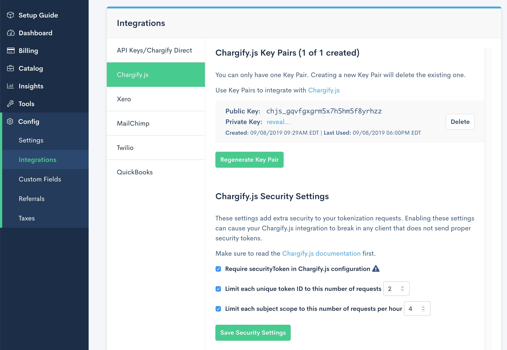

# Overview

## Using Chargify.js

Chargify.js is a powerful tool that can be used to streamline your existing API-based workflows in Chargify. Chargify.js can be used to easily contruct signup and payment profile updates on your existing sites.

## How it Works

Chargify provides transparent `iframes` that allow you to customize a customer's payment form. This approach ensures the you meet the latest [PCI compliance requirements.](https://maxio-chargify.zendesk.com/hc/en-us/articles/5404889785869)

When a customer submits your payment form, Chargify.js sends the customer payment information to be securely stored in your payment gateway.  In return, a one-time token is generated for you to use to complete the subscription process using our API. The one-time-payment token references the payment information that is securely stored in your gateway.



With this token you can create a subscription or payment profile assigned to the customer. Your PCI is significantly reduced, because of you don't pass any sensitive payment information. An example API call to the subscriptions endpoint would take the following form:

* token created in Chargify.js using type: 'credit_card'

```
{
  "subscription": {
    "product_handle": "pro-plan",
    "customer_attributes": {
      "first_name": "Joe",
      "last_name": "Smith",
      "email": "j.smith@example.com"
    },
    "credit_card_attributes": {
      "chargify_token": "tok_cwhvpfcnbtgkd8nfkzf9dnjn"
    }
  }
}
```

* token created in Chargify.js using type: 'gocardless' (this type has been deprecated in favor of 'direct_debit')

```
{
  "subscription": {
    "product_handle": "pro-plan",
    "customer_attributes": {
      "first_name": "Joe",
      "last_name": "Smith",
      "email": "j.smith@example.com"
    },
    "bank_account_attributes": {
      "chargify_token": "tok_cwhvpfcnbtgkd8nfkzf9dnjn"
    }
  }
}
```

* token created in Chargify.js using type: 'direct_debit'

```
{
  "subscription": {
    "product_handle": "pro-plan",
    "customer_attributes": {
      "first_name": "Joe",
      "last_name": "Smith",
      "email": "j.smith@example.com"
    },
    "bank_account_attributes": {
      "chargify_token": "tok_cwhvpfcnbtgkd8nfkzf9dnjn"
    }
  }
}
```


* token created in Chargify.js using type: 'apple_pay'

```
{
  "subscription": {
    "product_handle": "pro-plan",
    "customer_attributes": {
      "first_name": "Joe",
      "last_name": "Smith",
      "email": "j.smith@example.com"
    },
    "apple_pay_attributes": {
      "chargify_token": "tok_cwhvpfcnbtgkd8nfkzf9dnjn"
    }
  }
}
```

* token created in Chargify.js using type: 'pay_pal'

```
{
  "subscription": {
    "product_handle": "pro-plan",
    "customer_attributes": {
      "first_name": "Joe",
      "last_name": "Smith",
      "email": "j.smith@example.com"
    },
    "paypal_account_attributes": {
      "chargify_token": "tok_cwhvpfcnbtgkd8nfkzf9dnjn"
    }
  }
}
```

## Creating New Subscriptions

Use Chargify.js to allow new subscribers to securely enter their payment information from your site. Instead of sending a `credit_card_attribute` with your `POST` to the `/subscriptions` endpoint, your workflow will closely follow this outline:

+ A potential subscriber will complete a payment-based form on your site
+ Chargify returns a one-time token for you to use to complete the subscription request to the `/subscriptions` endpoint

## Updating Existing Payment Methods

In addition to creating new subscribers, use Chargify.js to create new payment methods. This workflow allows your existing subscribers to enter new card information on your site. From here, you'll use the token to send a `POST` to the `/payment_profiles` to create a new payment method.

+ An existing subscriber completes a payment-based form on your site, for the purpose of adding a new credit card to their account
+ Chargify returns a one-time token to use for adding a new payment method to an existing subscription

❗️ Chargify.js is not compatible with updating existing credit cards in Chargify. You may only add new cards to existing subscriptions, or create new subscriptions with recently tokenized card.

## Getting Started

1) To begin using Chargify.js, include the Chargify.js script on your page. This exposes a single global object, `Chargify`.

```html
<script src="https://js.chargify.com/latest/chargify.js"></script>
```

We recommend using the latest Chargify-hosted version of Chargify.js. This version is regularly updated to be compatible with the rest of the system.

2) Instantiate the Chargify variable on the page, or include it in a separate file attached to your frontend form:

```javascript
var chargify = new Chargify();
```

3) [Generate a public key](https://maxio-chargify.zendesk.com/hc/en-us/articles/5405281550477#key-pair-chargifyjs). This will be separate from your API key, which must be kept private.

4) Load Chargify with the authentication and customizations you desire. We  have a [full article here dedicated to this topic](./Chargify.js-Configurations.md).

5) Based on the selectors you have configured within `Chargify.load`, add those to your main form. Here's an example with some basic configuration included inline with a single selector to pull in all iframes:

```html
<!DOCTYPE html>
<html>
    <head>
        <script src="https://js.chargify.com/latest/chargify.js"></script>
    </head>

    <body>
        <form id='chargify-form'>
            <div id="chargify1"></div>

            <!-- While testing, you can remove the "hidden" type to expose the token for easy viewing. -->
            <input id="chargify-token" type="hidden" />

            <button type="submit">Submit Form</button>
        </form>
    </body>

    <script>
        var chargify = new Chargify();

        chargify.load({
            // selector, where the iframe will be included on your page
            // optional, if you have a `selector` for every field ('fields' option)
            selector: '#chargify1',

            // (i.e. '1a2cdsdn3lkn54lnlkn')
            publicKey: 'your-public-api-key',

            // payment profile type you will accept
            type: 'card',

            // points to your Chargify site
            serverHost: 'https://acme.chargify.com'
        });
    </script>
</html>
```

6) You should have a basic form at this point. Next, interrupt the submission of the form to send billing information to Chargify and get a one time token in exchange.

```javascript
document.querySelector('#chargify-form').addEventListener('submit', function(event) {
    var form = this;

    event.preventDefault();

    chargify.token(
        form,
        function success(token) {
            // optionally, you can assign a chargify token to a hidden field
            // or pass it to your backend in other way
            document.querySelector('#chargify-token').value = token;

            // and then submit the form
            form.submit();
        },
        function error(err) {
            // be aware that an error can occur for different reasons
            // while saving billing info in the gateway or directly
            // on the Chargify backend. It is rare but still possible.
            // Remember to make the user aware the presence of an error
            console.log('token ERROR - err: ', err);
        }
    );
});
```

7) After you get the token, you will submit it to your server and use it to [create a subscription](https://developers.chargify.com/docs/api-docs/b3A6MTQxMDgzODg-create-subscription) or [payment profile](https://developers.chargify.com/docs/api-docs/b3A6MTQxMDgzNTU-create-payment-profile) using our API.

❗️ Tokens expire after 20 minutes.

8) Now that the basic workflow of Chargify.js is working, add some styling to the form! [Here's an example of how it could look](./Examples.md#example-of-chargifyjs-form). Additional examples, both minimal and full, may be found at the bottom of that page.

## Handling Errors

When an error occurs on the back-end side, the `error` callback is invoked with the object having 2 properties:

```javascript
{
    status: 400, // HTTP status
    errors: "Your card was declined." // it can be an array of errors as well
}
```

## Single Page Applications

As of 2019-02-05 Chargify.js works with reactive frameworks like **[React](https://reactjs.org)**, **[Angular](https://angularjs.org)** or **[Vue](https://vuejs.org)**.

We have published two repositories with sample apps that demonstrate how to use Chargify.js with those frameworks:

* [React example app](https://github.com/chargify/chargify-js-react-example)

* [AngularJS example app](https://github.com/chargify/chargify-js-angular-example)

* [Vue example app](https://github.com/chargify/chargify-js-vue-example)

## Hosting and Technical Considerations

The static files on `https://js.chargify.com` are hosted via AWS Cloudfront. They use a different set of HTTP & TLS specifications than `https://app.chargify.com`. As such, their compatibility with various browsers and clients may be different. It also may be
affected by different failures than our primary app.

Specific technical considerations to be aware of:

* TLS is terminated by Cloudfront using the `TLSv1.2_2018` config.  TLS 1.0 and TLS 1.1 are not supported.  The full cipher suite list is [available from AWS](https://docs.aws.amazon.com/AmazonCloudFront/latest/DeveloperGuide/secure-connections-supported-viewer-protocols-ciphers.html#secure-connections-supported-ciphers)
* Utilizes SNI for TLS, which can result in lower compatibility with browsers than the Chargify application. Akamai has [published a study](https://blogs.akamai.com/2017/03/reaching-toward-universal-tls-sni.html) describing the evolution of browser support for SNI and it is very high, but not perfect.
* Supports HTTP/2, HTTP/1.1, HTTP/1.0
* Through the use of AWS Cloudfront, `https://js.chargify.com` is designed for maximum reliability and speed, but is not covered by our SLA, uptime, or performance guarantees.

❗️ When you use Chargify.js, your workflow is classified as SAQ-A. For more information, please see our documentation on [PCI compliance](https://maxio-chargify.zendesk.com/hc/en-us/articles/5404889785869).

## Passing Pre-Filled Customer Information

It's possible to collect the following outside of the Chargify.js, then pass it along with the token submission to store it on the payment profile:

+ First and last name
+ Billing address (street address, city, state, country, zip)

Pre-filling the customer name can make for a more personalized experience, for example if they already exist within your application or your signup flow has multiple steps involved. Additionally, pre-filling the address may be useful if you need to use an outside library to verify the address first, or have already collected an address from the customer.

To make use of this functionality, do not include any of the address iframe fields within the Chargify.js `chargify.load()` script. Instead, include the hidden fields below within the HTML form and dynamically fill in the `value` of each field with the desired information:

```html
<div class="host-field">
  <input type="hidden" class="host-input" data-chargify="firstName" value="Jane"/>
</div>
<div class="host-field">
  <input type="hidden" class="host-input" data-chargify="lastName" value="Mehmed"/>
</div>
<div class="host-field">
  <input type="hidden" class="host-input" data-chargify="address" value="123 Main St"/>
</div>
<div class="host-field">
  <input type="hidden" class="host-input" data-chargify="address2" value="#321"/>
</div>
<div class="host-field">
  <input type="hidden" class="host-input" data-chargify="city" value="San Antonio"/>
</div>
<div class="host-field">
  <input type="hidden" class="host-input" data-chargify="state" value="TX"/>
</div>
<div class="host-field">
  <input type="hidden" class="host-input" data-chargify="country" value="US"/>
</div>
<div class="host-field">
  <input type="hidden" class="host-input" data-chargify="zip" value="12345"/>
</div>
```

## Security

Using Chargify.js, you are able to tokenize cards with Chargify and your gateway. Since most of our gateways also perform a "card validation" as a part of tokenization, you should take measures to protect the use of your Chargify.js forms from bad actors with the intent of mass-validating stolen card credentials.

By default Chargify offers a layer of fraud prevention on the tokenization endpoint that works silently to protect your tokenization endpoint. Additionally, your gateway may provide fraud detection tools that will guard against unwanted card tokenization/verification.

In addition to these tools, Chargify offers you configuration to improve the security of your Chargify.js form submissions. Our "security token" allows you to sign your official form submission using a private key shared between yourself and Chargify, and our configuration allows you to choose your tolerance for repeated form submissions.

By its very nature, Chargify.js allows end-users to submit cardholder data directly from their client environment to the Chargify servers. You are purposefully cut out of the loop of the tokenization process. You must later make a server-to-server API request to make use of the token, which is protected by your API key(s). So, remember, that the purpose of these security measures are to reduce the ability of a hacker to tokenize cards in a bulk fashion, and does not affect the act of subscription creation or token use - the latter is already protected by the use of your protected API keys.

### Security Token

| ❗️  As of 2023-05-16 the Security Token and all related settings are enabled by default for all new sellers. Managing those settings by hand is no longer possible. However if you are sure you want to change them, please reach out to the support. Remember that you are doing so on your own responsibility. |
|-----------------------------------------------------------------------------|

The generation of a security token requires your Chargify.js private key. You may generate or review your Chargify.js key pair from Integrations > Chargify.js. The private key is initially hidden, but you can click-to-reveal and then copy the value.



The private key is required to sign your security token. **Do not share your private key publicly!**. You will need to generate your security token on the server, and then share the resulting token (and not your private key) with your client-side Chargify.js config.

The security token is a signed [JSON Web token (JWT)](https://jwt.io/) that makes several claims. As long as your private key is kept private, no one else can make new valid claims on your behalf.

The token must be signed using your private key using the HMAC SHA 256 (HS256) algorithm.

#### Claims

The claims are included in the payload of your JWT:

* `iss` Issuer (Required): Issuer must be set to the value of your Chargify.js public key. This is the only required claim. By using this claim, an attacker cannot formulate their own requests using only your public key. However, you are still immune to replay attacks - once an attacker loads an officially sanctioned Chargify.js form, they will also have a valid security token. Therefore, this claim should be used in conjuction with one of the following claims.
* `jti` JWT ID (Optional): "JWT ID" should be set to a unique value each time you generate a Chargify.js form for submission. Using the security configuration, you can limit your exposure to replay attacks by limiting the number of times each unique `jti` may be used to attempt a card tokenization. With the protection of this claim, attackers would need to continually load your officially sanctioned forms to obtain new, valid security tokens. This gives you an ability to detect and prevent abuse from your app, where the forms are generated.
* `sub` (Optional): "Subject" should be set to a value that identifies the user or account within your system, especially when your Chargify.js tokenization forms are protected behind a login. With the protection of this claim, you can limit the number of tokenization requests per user in your system to a value that is consistent with your user experience. To exploit your tokenization forms, attackers would need to continually generate new accounts in your system, which gives you another opportunity to prevent abuse from your app if you prevent the creation of throwaway accounts.

#### Token Example

Your JWT must include at least the `iss` claim, and should be signed using the HMAC SHA 256 (HS256) algorithm using your private key.

An example in Ruby using the [JWT Rubygem](https://github.com/jwt/ruby-jwt) follows. You can use this example to ensure that your JWT library produces the same result that we expect.

```rb
@security_token = JWT.encode(
  {
    iss: "chjs_mypublickey",
    jti: SecureRandom.hex, # "b8a9044cbada8b24a230ff8934663843"
    sub: current_user.account_id.to_s, # "4035"
  },
  "chjs_pvt_myprivatekey",
  "HS256"
)
```

The token should then be provided to your Chargify.js client-side configuration under the key `securityToken`.

For example, you could emit the security token into your HTML if you do configuration inline:

```html
<!-- form.html.erb -->
<script>
  var chargify = new Chargify();

  chargify.load({
      selector: '#chargify-form',
      publicKey: 'chjs_mypublic_key',
      securityToken: '<%= @security_token %>',
      type: 'card',
      serverHost: 'https://acme.chargify.com'
  });
</script>
```

Or, you could emit the security token to an element on your page and then fetch it from the DOM.

```js
// client.js
// DOM has element <div id="jwt" data-security-token="<%= @security_token %>"></div>
const securityToken = document.querySelector("#jwt).dataset.securityToken;
var chargify = new Chargify();

chargify.load({
    selector: '#chargify-form',
    publicKey: 'chjs_mypublic_key',
    securityToken: securityToken,
    type: 'card',
    serverHost: 'https://acme.chargify.com'
});
```

### Security Configuration

Once you are sending valid security tokens to the server, you can enable the settings to require the token and enforce limits.

There are three configuration choices:

1. **Require securityToken.** This option must be enabled in order to enable the other two options. Note that, with this option enabled, you are only ensuring that your signed JWT is required with each form submission. An attacker could still navigate to your page, load your sanctioned form, and then be able to replicate your form.
2. **Limit each JWT ID to a certain number of total requests.** This helps to prevent replay attacks. Each time an attacker visits your sanctioned form, they will only be able to re-use the security token for the total number of submissions listed in this configuration. Keep in mind that legitimate users may submit your form a few times before they provide all of the required fields. So, unless you are re-initializing the security token after each form submission, consider allowing at least 5 attempts before blocking.
3. **Rate limit per account scope (i.e. user or account ID from your app) to a certain number of requests per hour.** This is the best option for those setups where the Chargify.js forms are only available on a logged-in page on your app, such as a "My Account" page. Normal users don't need to update their card more than a few times in an hour, so consider setting this to a low value like 5.

#### Errors

These are the errors and status codes that can be returned from the tokenization process when you enable the security settings.

| Status Code | Message | Description |
| ----------- | ------- | ----------- |
| 401         | The security token is invalid. | The security token has been marked as required, and it was either not provided, is invalid, is incorrectly signed, or has the wrong value for `iss` (which should be set to the public key). |
| 401         | The security token is missing required data. | The security token requires either `jti` or `sub`, but the required value was not supplied. |
| 429         | The security token has exceeded the configured rate limits. | Either the same `jti` value has been used more than the allowed number of times, or the same `sub` value has been used more than the allowed number of times in one hour. |
