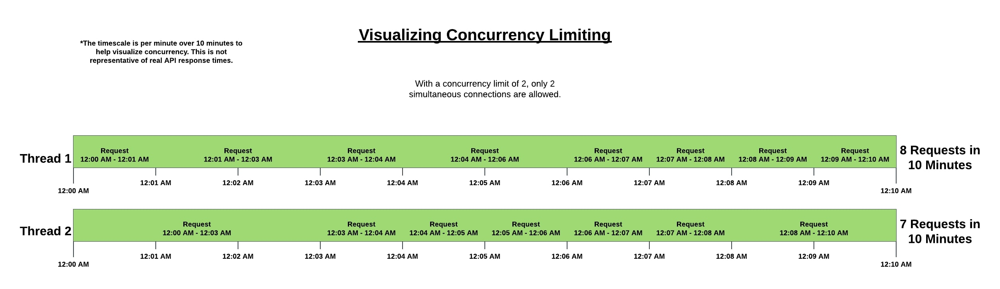

# API Guidelines

Our many merchants all use our API for different purposes. API access is included on all plans at no charge because we believe that you are the owner of your data and you should never feel like your data is "locked up".

However, because the API means there is little or no user-interaction, it can be very easy to create a program or routine that causes an unnecessarily high burden on our system. Even small accounts can generate huge numbers of expensive API requests by accident.

In order to maintain a high quality of service for everyone, we ask that you be cautious when implementing your API integration to avoid run-away usage that is disproportionate to the size of your account.

Here are some tips and best-practices to help keep both your site and ours running smoothly.

## Getting Subscription States

You likely want to check if your customer has an active account, has cancelled, or is behind on his/her payments. The best approach is to keep a local cached copy of the subscription’s state in your own database. You can use [Webhooks](https://developers.chargify.com/docs/api-docs/b3A6MTQxMDgyNjU-create-endpoint) to keep up-to-date in near real-time on any changes that occur. This keeps your website up, reduces your coupling to Chargify, and ensures both sites remain as fast as possible.

Avoid querying Chargify in-line as part of a customer’s request to your site. Doing so could result in:

+ Slowing down your own site while the customer waits for a check to Chargify on every request.
+ If there is a network connectivity issue or in the unlikely event that Chargify is down, your site will also break.
+ As you grow and your customers are more active, you will use up huge numbers of API requests that could result in being blocked because of our automatic abuse prevention.

## Synchronizing Your Database

Normally you should keep your local customer database in sync by using [webhooks](https://developers.chargify.com/docs/api-docs/b3A6MTQxMDgyNjU-create-endpoint). But if you think your database has become out of sync with Chargify, then using the API to check the state of all subscriptions may be the only way to ensure consistency.

It’s perfectly okay to do this as needed. But it should generally only be relied upon in exceptional circumstances or for periodic reconciliation (usually no more than once a month).

## Reporting Usage

When reporting component usage, avoid sending lots of tiny usage amounts. If you charge by the minute for phone calls, for instance:

+ **Don’t** send in a usage for every minute or every phone call individually.
+ **Don’t** send all usage for all customers all at once. Spread it out or wait a short period of time between each request

Instead:

+ **Do** send a usage report once a day with how much a customer used for the whole day.

For more information on reporting component usage or allocations, please see the specific section for the type of component used:

+ [API docs for reporting metered usage](https://developers.chargify.com/docs/api-docs/b3A6MTQxMDgzODQ-create-usage)
+ [API docs for allocating quantity-based components](https://developers.chargify.com/docs/api-docs/b3A6MTQxMDgzNzg-allocate-component)

## Downloading Bulk Data

Periodically exporting transaction, subscription, or customer data is a common use case. When possible, we recommend using the built-in [export](https://help.chargify.com/reports/exporting-data.html) functions inside Chargify to generate reports and download the data. This can often be much faster and can significantly lower your API usage.

## About Limits & Blocks

There are two different types of limits/blocks you may encounter: rate-based and account-based. Please familiarize yourself with both types of limits, as they are vastly different.

Our rate limiting rules are primarily intended to prevent runaway scripts, infinite loops, or crushing amounts of concurrency. Working, good-hygiene code should not experience any blocks. The single most important guidelines are to write code that will properly handle 429 responses by slowing or pausing requests without crashing, and to not parallelize into simultaneous requests that will compete for resources and flood our systems.

Chargify uses a custom algorithmic slot-based limiting that isn't based on typical rate limit / seconds. Rather, we handle call limiting based on concurrency, and API calls can be requested at a max of 4 concurrent requests. This does not mean that only 4 requests are allowed per second -- rather, 4 server threads / workers can be running concurrently per subdomain at a time. Any concurrency that goes above 4 is at risk for being queued for processing after the concurrency once again drops to acceptable ranges. As such, we recommend when building out your API processes to focus on the number of concurrent calls rather than the actual rate of calls per hour.

To help illustrate this, we've provided a diagram below. Presume that each API call takes a full minute. While this will likely not be the case for your own processes, it does illustrate the limitations for calls.

|  |
| -- |
| **Diagram of concurrency-based rate limiting presuming a limit of 2 threads at a time** |

### Rate-based Blocks

When doing a large synchronization or retrieving a large amount of data, you may trigger a security failsafe used to prevent abuse and protect our site from attacks. We don’t want to block small bursts in usage. So instead of immediately rejecting your requests, Chargify will slow and throttle requests.

❗️ If you see your responses coming in slower, do not parallelize your requests or try to make more concurrent requests to speed things up. You’ll only have to wait longer for your requests to get through.

If you have too many slowed requests, or your individual account queue gets too full with too many concurrent requests, you’ll likely receive an HTTP `429 Too Many Requests` response code with a message and a reference code:

`Your request was denied due to a usage violation. You can track this request with support by referencing …`

If you receive a `429 Too Many Requests` response, your code should be prepared to handle it by pausing its queries, waiting a few minutes, and then proceeding slower (or with less concurrency). Please feel free to [contact support](https://chargify.zendesk.com/hc/en-us/requests/new) so we can help describe what happened and why the request was blocked.

### Account-based Blocks

There are a few scenarios that may end up in causing an API request to be blocked even with correct credentials. You can read about them [here](https://developers.chargify.com/docs/api-docs/YXBpOjE0MTA4MjYx-chargify-api#api-access-limitations). If you have a request blocked with a `422` status code and an error message, it may be due to this account-based blocking.

### Prioritization of Endpoints

We consider certain endpoints as "critical", such as new customer signups and component allocations.  We first and foremost want to ensure that we don't prevent a new signup except under the most extreme situations.  Many merchants have a mix of all different types of calls.  By dynamically balancing, we can slow down "low priority" requests (reports and exports), while still handling large unexpected surges in signups.

### Endpoint Variances

Each endpoint is different within Chargify. Expensive endpoints have lower limits than fast endpoints. But in general, your requests will slow down because of sending too many simultaneous requests to the same endpoint(s). When you do that, your requests will be "queued" behind yourself. One request must wait for the one in front of it to finish. In that way, we 'level out' spikes of requests over a longer period of time so that it doesn't cause a negative impact for other merchants. This is why you'd see requests be processed at a slower rate.

### Timeout Limitation

Chargify imposes a cut-off time of 120 seconds for all requests to all endpoints. It's important to note that when you make requests for specific actions, Chargify is also sending these requests off to your associated gateway. If a request is not processed by the combination of Chargify and your gateway within the 120 second guideline, the request will time out. 

Please keep in mind that if you encounter a timeout issue, it is worth inspecting your gateway's [current status.](https://help.chargify.com/payment-gateways/gateway-documentation.html) This is also important to do if you feel there is a processing issue outside of Chargify's control is affecting your requests. 

